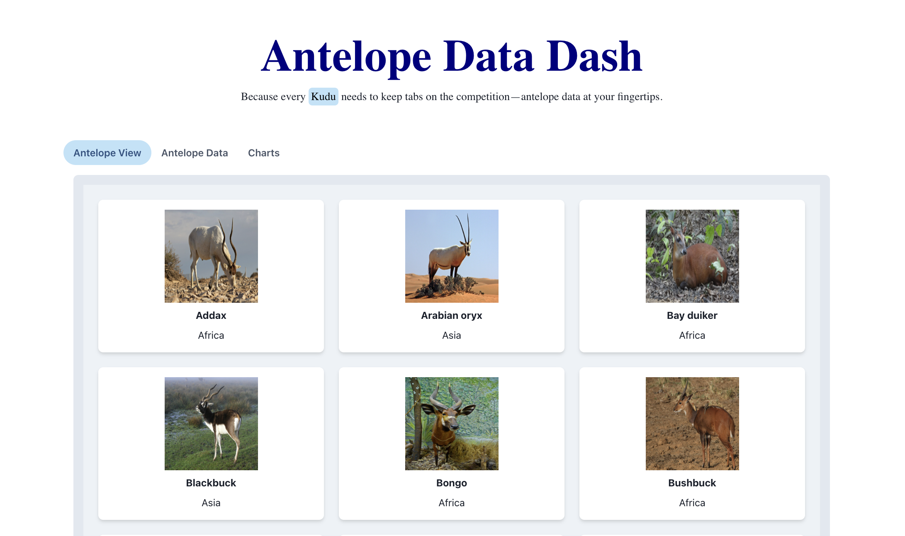

# 🦌 Antelope Data Dash

Welcome to the **Antelope Data Dash** project! This web application is designed to visualize and compare various antelope species through interactive data tables, charts, and fact cards, giving users insights into the unique characteristics of each species.

## 🛠️ Tech Stack
- **Frontend:** React.js, ChakraUI, Recharts
- **Backend:** Node.js, Express.js

## 🌟 Features

- **Data Table:** Displays a comprehensive list of antelope species with key attributes like name, weight, height, horn type, and continent.
- **Interactive Charts:**
  - **Bar Chart:** Visualizes the weight per species.
  - **Pie Chart:** Illustrates the distribution of species across continents.
  - **Scatter Plot Chart:** Shows the correlation between weight and height of different species.
- **Fact Cards:** Presents interesting facts and images for each antelope species.
- **User Interaction:** Allows users to select different charts and components through dropdowns and tabs for a customized viewing experience.

## 🚀 Process

Starting with the frontend, I built a React.js application using ChakraUI for UI components and Recharts for data visualization. The backend was developed with Node.js and Express.js to serve the antelope data. The development process involved creating modular, reusable components for the frontend and a simple, efficient server structure for the backend. 

## 📚 Learnings

- **Data Visualization:** Enhanced my skills in creating dynamic and interactive charts using Recharts.
- **Component-Based Architecture:** Gained deeper insights into organizing a React.js project with reusable components and custom hooks.
- **Antelope Data Handling:** Recognizing that six antelopes were being fetched unnecessarily, I improved the efficiency by passing the antelopedata as a prop to the main component. The outcome is now optimized to display only two antelopes. Additionally, if strict mode is commented out, only one antelope should be displayed, ensuring minimal data processing and rendering.


## 🔧 Improvements

- **Advanced Filtering:** More sophisticated filtering options could be added to allow users to customize their data views.
- **Scalability Considerations:** The current implementation re-renders frequently, which could become a bottleneck with larger datasets. Ideally, logic could be moved to the server-side, and a paginated view could be implemented to efficiently handle large volumes of data. However, given the current dataset size, managing this on the frontend seemed sufficient for now.
- **Testing:** Unit and integration tests were not implemented, but they are essential for ensuring reliability and stability. Adding comprehensive tests would be a priority if the project were to continue.


## 🛠️ Running the Project

1. **Clone the repository:**
   ```bash
   git clone https://github.com/joana-nicolaasponder/madkudu-worksample.git

2. **Install the dependencies:**
    ```bash
    cd madkudu-worksample
    npm install
    
3. **Run the project:**
    ```bash
    npm run dev

## 🎥 Video or Image
Check out the screenshot below to get a quick overview of the Antelope Data Dash project in action!


<div>
    <a href="https://www.loom.com/share/9c94a041605a4e9092594f14998223a2?sid=59fbf090-6d2c-4311-8bfb-7e9da7f663c4">
      <p>Antelope Data Dash - Demo</p>
    </a>
    <div>
    <a href="https://www.loom.com/share/9c94a041605a4e9092594f14998223a2">
    </a>
    <a href="https://www.loom.com/share/9c94a041605a4e9092594f14998223a2">
      
    </a>
  </div>
  

